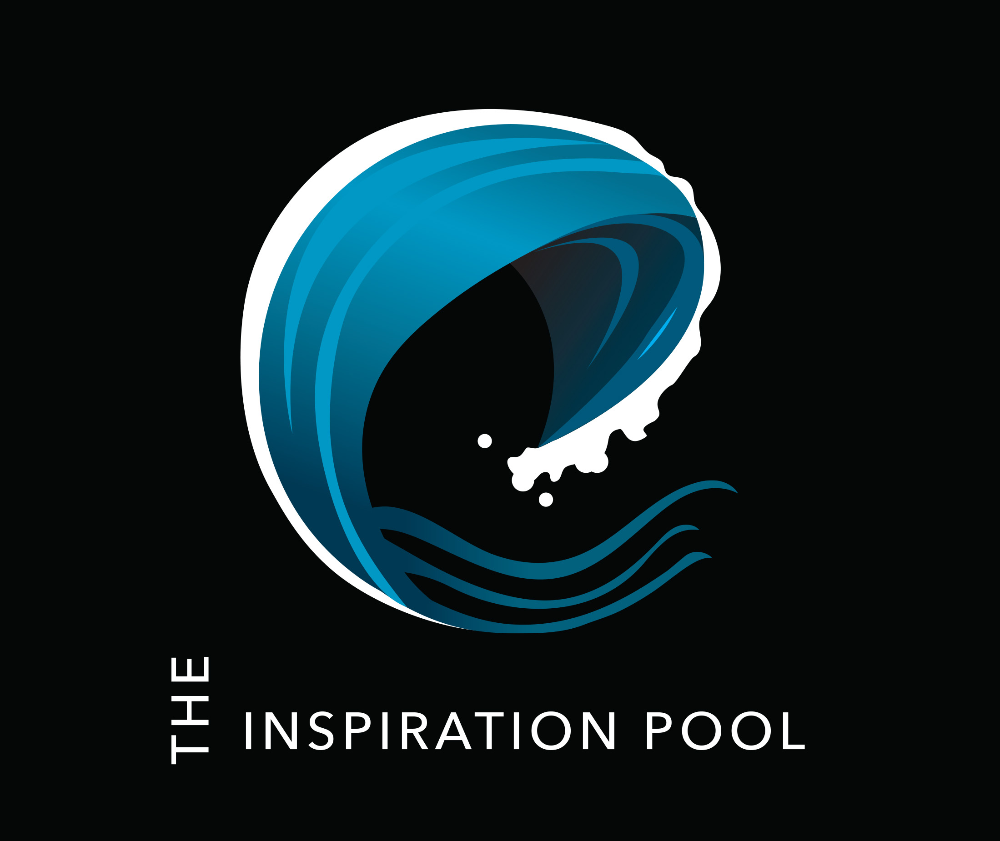

# Introduction

Hi guys, and welcome to the Inspiration Pool! This blog is 100% made for it’s users. It’s not another boring blog created to show off personal growth or document lunch recipes. Instead, I wanted to create a collaborative space that inspires artists and gets them thinking about new ideas. Have you ever had creative block? It’s the worst thing in the world; it slows down productivity, it’s mentally draining, and it makes you feel completely worthless as an artist. 9 times out of 10, when experiencing creative block, we turn to the internet for inspiration. I myself have found that the internet can sometimes interfere with my progress with the distractions of social media. The Inspiration Pool is the perfect place to land when needing fresh new ideas.

“Some of the biggest bursts of creativity I’ve had are usually preceded by a big creative block.”  -Ashley Goldberg

The Inspiration Pool aspires to be the website that brings artists to that “burst of creativity.” Rather than scrolling through Pinterest or Instagram for hours at a time, check out some of the Inspiration Pool’s blog posts, engage with other artists, and leave feedback. This blog is meant to feel communal and welcoming. It’s the perfect place to learn something new, from artists who want to help.

